# D&D Dataset

## How Logistic Regression helps to analyse if players Multiclass in D&D due to MinMaxing/Mechanics Decisions or Roleplaying and what factors affect the decision?

### Executive Summary

The player base of Dungeons & Dragons is wide and varied, especially since it exploded in popularity in 2015. This project, through logistic regression, aimed to determine the factors that made a player multiclass – which “allows you to gain levels in multiple classes” (Wizards of the Coast, 2014 p. 163) - to analyse what is sought out by multiclassing, and if it could be a roleplaying decision or a mechanics decision. This could be mirrored in business by finding out the different variables that determine how a store performs and whether those variables can be controlled to increase sales revenue and better manage community needs. It was found that total level and number of feats have made the greatest statistical difference, and so far, the model has achieved balanced accuracy of 63%. Results show at present that meeting the requirements for multiclassing and levelling up increases the likelihood, but roleplaying decisions make a significant impact on why. Recommendations are to open the pool of factors by providing further analysis on the dataset and re-run the model with new variables.

### Data Infrastructure and Tools

The Dungeons & Dragons (D&D) dataset was found on Kaggle. Its Usability score the website calculates was a full 10, and though it was last updated 3 years ago, the D&D environment tends to be slow moving. Dungeon & Dragons Fifth Edition (or 5e) was released in 2014, with additional resource books being released each subsequent year, although these books are not required to play the game. The dataset mentions the data was pulled from D&D Beyond, an online platform owned by the publishers of D&D that stores character data for use in physical and online games. Due to the platform having a free account option, it is worth mentioning people could create player builds for fun and some of the characters could not have seen actual play, which may create a bias towards optimisation as opposed to roleplaying decisions, but it is impossible to tell at this point. 

The dataset was initially loaded and cleaned in Power Query in Excel, as it is the company standard and due to the analyst’s familiarity with the tool. Power Query and in relation, M is “a powerful tool for data professionals… the versatility and capabilities of M make it a valuable language to learn” (Deckler, de Groot and de Korte, 2024) The dataset was initially 1.2 million rows, but Power Query’s ability to quickly create custom columns in M and filter out anomalies was essential in preparing the data to then be loaded into Python.

Python is not a typical tool for the analyst, but it’s versatility in loading in custom libraries and having mostly everything a user could need at their fingertips was a valuable resource. Logistic Regression is not something easily done in Excel and prior teaching showed how quickly Python can load, check and process data so it was the optimal choice. The dataset is larger than typical for the apprentice so the speed at which is works was a considerable benefit. 

### Data Engineering

The data was loaded into Power Query to commence cleaning. All 0’s in a stat such as Strength or Dexterity were removed as they are invalid as per the rules of D&D. 

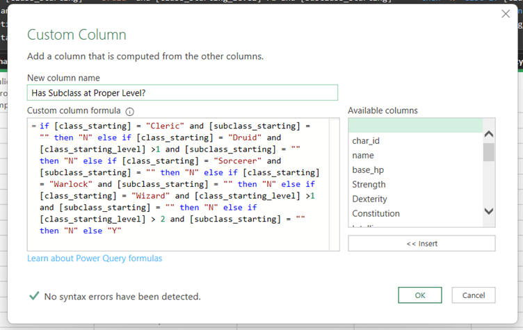 

_Figure 1 - A custom column checking if a character has a subclass at the appropriate level to improve the validity of the dataset._

Then a custom column was created to check that each character had a subclass at the appropriate level. If there was no subclass and the level was above the threshold of the level that class received one, it was flagged with an “N” that was then filtered out.

Then “class.other” was split out, and the first column checked to see if a player character had multiclassed where it would be flagged with another custom column. This process happened again with Feats, where a column was created that displayed the number of feats taken.

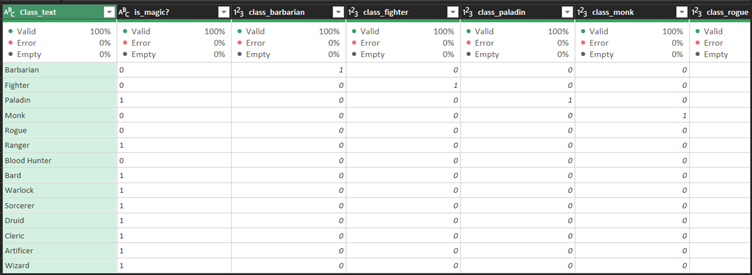 

_Figure 2 - Class reference table to be read better by the python model._

The dataset was then merged with a reference table for class, that has a column for each class with a 1 for yes and 0 for no. A column for if each class has magic is in the dataset and was merged alongside to see if it would be useful as a determining factor.

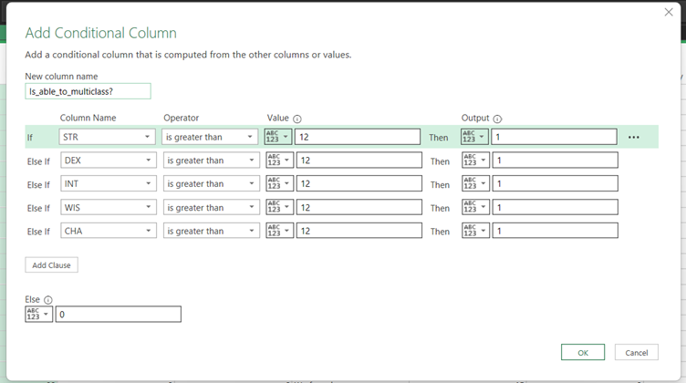 

_Figure 3 - Conditional column checking if the stats allow a multiclass option._

Then a conditional column was added to check if any of the stats needed to multiclass were present and if so to report a 1. 

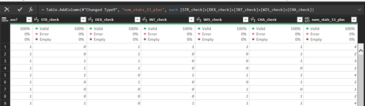 

_Figure 4 - Column added determining number of stats above 12._

Each stat was checked individually and a column created displaying the number of stats above 12 was created as this should represent the ability to multiclass, and the higher the number, the more options available. 

Finally, a new column was created to remove illegal characters, by check if they had multiclassed and num_stats_13_plus was 0 then to give them and “N” which was filtered out. The resulting dataset was then narrowed to 977,647 rows.

### Data Analytics

It is worth stating that Dungeons & Dragons is an incredibly creative tabletop roleplaying game (TTRPG) based on a narrative produced by the Dungeon Master (DM) or Game Master (GM) and informed by the choices of the players. Therefore, the story, world it is set in and the creativity of the DM, as well as if it a prewritten adventure versus an original campaign are all aspects that are not recorded but can impact the choices available to players as discussed by Salthouse, E, (2025, pp. 5-8) , such as that of multiclassing. Therefore, the model is considering only the mechanics of the game and the results will most likely reflect this. 

That said, the data was saved and uploaded to Google Drive where it was then pulled into Google Colab. 

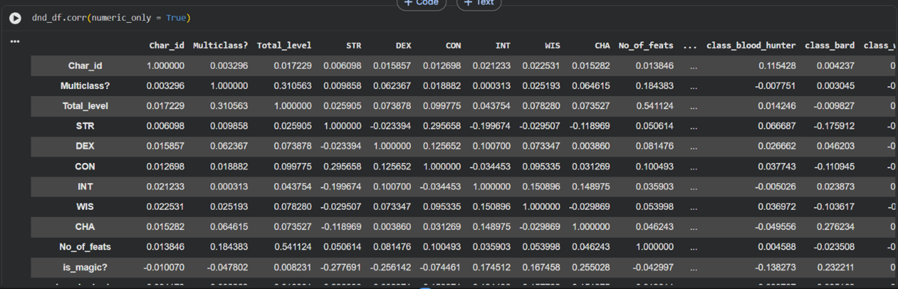 

_Figure 5 - The dataset was correlated to see anything noticeable._

Using the Logistic Regression code from the Data Analytics Module (Poutney, L, 2025) as a base, the data was initially correlated. 

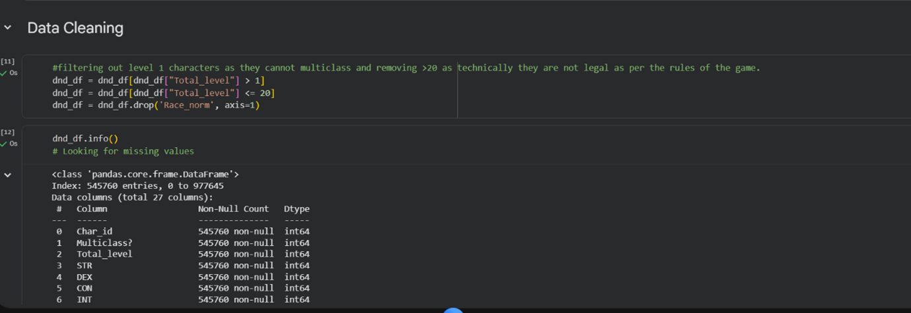

_Figure 6 - Removing illegal characters and checking for missing values._

The next steps were to remove illegal characters, as you can only multiclass on a level up and the maximum level is 20, so characters past 20 or at level 1 are not valid. Then missing values were checked and none were found. 

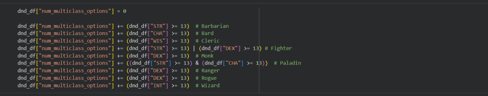

_Figure 7 - num_multiclass_options was added to see the number of players that met the requirements to multiclass._

A new column was added to check the players against the requirements of multiclassing and see how many options were available. 

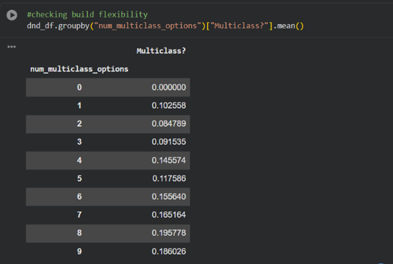

_Figure 8 - The column was then grouped._

The new column was then grouped to see if the number of options influenced if a character multiclassed. We can see that Multiclassing increases the more options are available, peaking at 8.

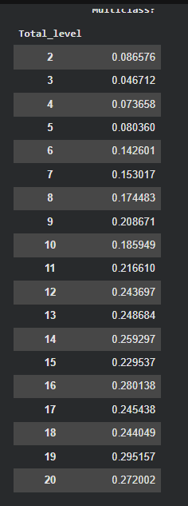

_Figure 9 - GroupBy Total_level to see at what levels Multiclassing increases._

Then a GroupBy is done to see at what levels of characters are more common to have multiclassed. 

A check for nulls is done, then a correlation heatmap is created to see visually where the correlations lie. 

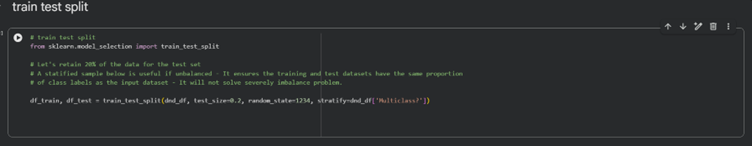 

_Figure 10 - Splitting the data into test and train sets._

Then the data is split into test and train sets.

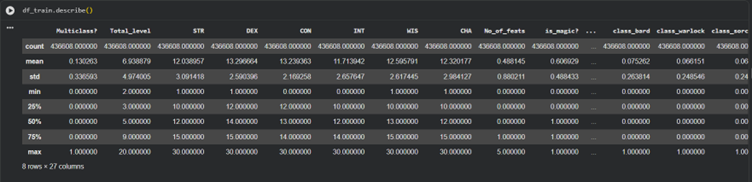

_Figure 11 - EDA on the train set._

The train set is looked at using describe, checking the general shape and dispersion of the set. 

The train model is set up, then the predictions are set, with the probability set to 0.1 as this gave the best results. When set higher, the model tended to assume all characters were not multiclassing.

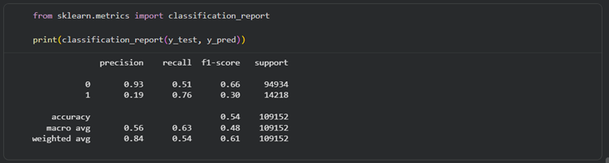

_Figure 12 - The classification report._

The classification report was then printed, showing a .93 precision for a character who has not multiclassed, but only 0.19 for a character that has. The F1-Score was 0.66 to 0.30 and the Recall was 0.51 to 0.76. 

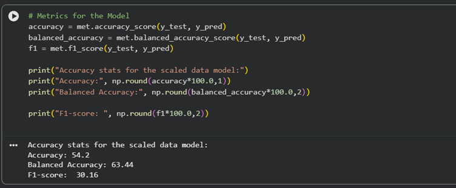

_Figure 13 - printing the accuracy stats._

The accuracy stats are printed, and the balanced accuracy score sits at 63.44%, as well as the F1-Score sitting at 30.16%.

The ROC curve and confusion matrix are pulled and will be discussed in the Data Visualisation section. 

RN |feature|	coefficient |	exp 
---|---|---|---
0 |	Total_level	| 0.099651 |	1.104785
1 |	STR |	-0.077593 |	0.925341
2 |	DEX |	-0.050156 |	0.951081
3 |	CON |	-0.044536 |	0.956442
4 |	INT |	-0.082826 |	0.920512
5 |	WIS |	-0.027580 |	0.972796
6 |	CHA |	0.021442 |	1.021674
7 |	No_of_feats |	0.051719 |	1.053079
8 |	is_magic? |	-0.476839 |	0.620743
9 |	class_barbarian |	0.084257 |	1.087908
10 |	class_fighter |	0.315005 |	1.370267
11 |	class_paladin |	0.154145 |	1.166660
12 |	class_monk |	-0.215442 |	0.806185
13 |	class_rogue |	0.130724 |	1.139653
14 |	class_ranger |	0.313629 |	1.368382
15 |	class_blood_hunter |	-0.235532 |	0.790150
16 |	class_bard |	-0.025814 |	0.974516
17 |	class_warlock |	-0.204725 |	0.814871
18 |	class_sorcerer |	-0.039197 |	0.961561
19 |	class_druid |	-0.246548 |	0.781494
20 |	class_cleric |	-0.105259 |	0.900091
21 |	class_artificer |	0.018294 |	1.018463
22 |	class_wizard |	-0.341362 |	0.710801
23 |	Is_able_to_multiclass? |	-0.028935 |	0.971479
24 |	num_stats_13_plus |	0.399831 |	1.491572
25 |	num_multiclass_options |	0.035465 |	1.036102
26 |	meets_class_requirement |	-0.064047 |	0.937961

_Figure 14 - coefficients and log odds are printed._

Finally, the coefficients and log odds are printed and through them, we can see the biggest effects come from Total_level, class_fighter, class_paladin, class_ranger and num_stats_13_plus.  

### Data Visualisation

TThroughout the model, visuals were used to see more effectively what the dataset looked like. 

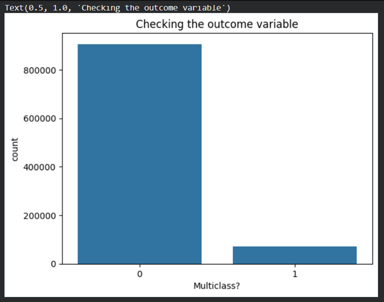

_Figure 15 - Column chart for Not Multiclassed Vs Multiclassed._

A column chart was used to see the split of characters that did not multiclass vs did and demonstrates that it is not a common choice to put levels into a class different from the one you initially chose. 

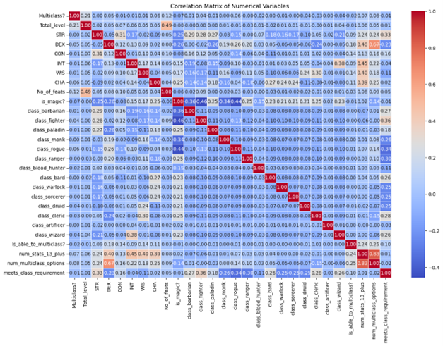

_Figure 16 - Correlation Heatmap_

Correlation matrixes that are just text do not get across a picture of the data as easily as a heatmap, especially with more variables, so one was made in order see more easily where there were links. From this we can all the correlations much better, such as Total Level with Number of feats, or DEX with Number of Multiclass Options. Reverse of that, we can see that the martial classes negatively correlate strongly with Is Magic? and how negatively DEX and dexterity-based classes like monk, rogue and ranger correlate with Meet Class Requirement, which is very interesting. Requirements are not put upon a class a player chooses at creation, only when multiclassing, so it is interesting that these classes often have a lower primary stat than other classes. 

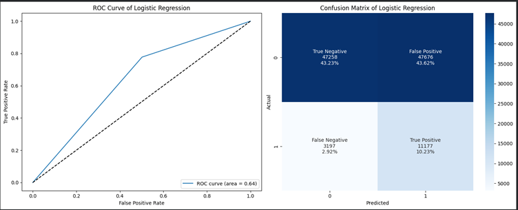

_Figure 17 - ROC Curve and Confusion Matrix_

Finally, the ROC Curve and Confusion matrix are some of the most important visualisations when it comes to Logistic Regression. As Yang, S and Berdine G (2024) stated:

“Both the confusion matrix and the ROC curve are essential tools for evaluating classifier performance, but they serve different purposes. The confusion matrix offers insights into performance at specific decision points, detailing metrics such as precision, sensitivity, and accuracy at a particular threshold. In contrast, the ROC curve plots sensitivity against the FPR (1– specificity), at various classification thresholds, which summarizes performance across all possible thresholds, providing a broader perspective on how effectively the classifier distinguishes between positive and negative classes.”

The ROC Curve here tells us immediately the likelihood of error as does the Confusion Matrix. The curve is not the only indicator of the model’s success but it is a good one, showing the True Positive vs the False Positive rate, and shows that to get the model to become better, something needs to change.

The confusion matrix shows us something similar, and from one look we can see the False Positive rate is too high for the model to be used now and that something needs to change for this model to become better.

Another method may also be worth exploring, such as K-Means clustering to see what aspects can be grouped together to define the factors that go into multiclassing, and perhaps answer some follow up questions. 

### References:

Deckler, G., de Groot, R. and de Korte, M. (2024) The Definite Guide to Power Query (M). Birmingham: Packt Publishing.

Poutney, L. (2025) Data Analytics: Topic 4 – Logistic Regression. BPP University 

Salthouse, E. (2025) ‘Playing Makes Believing: Narrative Creating in Tabletop Role-Playing Games’ University Honors Theses.  Paper 1646. Available at: https://doi.org/10.15760/honors.1678 (Accessed 30 April 2026).

Wizards of the Coast. (2014) Player’s Handbook. Renton: Wizards of the Coast. 

Yang, S. and Berdine, G. (2024) ‘Confusion matrix’. The Southwest Respiratory and Critical Care Chronicles, 12(53), pp.75-79. Available at: https://doi.org/10.12746/swrccc.v12i53.1391 (Accessed 30 April 2026).

